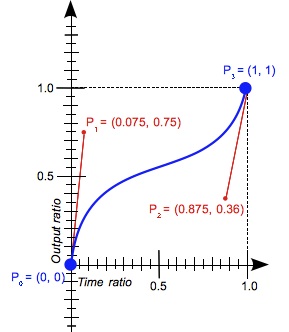
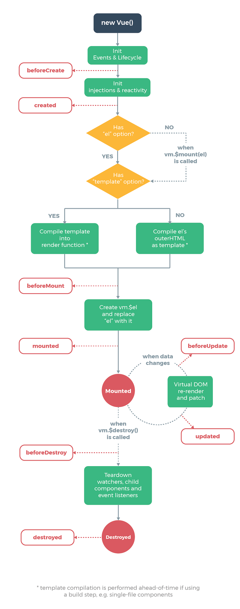

- [HTML](#html)
  - [CSS](#css)
- [ES6](#es6)
- [jQuery](#jquery)
- [Nodejs](#nodejs)
  - [Express](#express)
- [Webpack](#webpack)
- [Vuejs](#vuejs)
- [Bash](#bash)
  - [NPM](#npm)
- [Git](#git)
- [Sublime](#sublime)

## HTML
```
<a href="javascript:viod(0);"></a>
页面跳转为空（死链）
```
```
<a name="label">锚（文本）</a>
<a href="#label">文本</a>
```
```
模板字面量 是允许嵌入表达式的字符串字面量。你可以使用多行字符串和字符串插值功能。在ES2015规范的先前版本中被称为“模板字符串”。
`
<div class="blog-post">
  <h3>{{ post.title }}</h3>
  <div v-html="post.content"></div>
</div>
`
它们在 IE 下并没有被支持，所以如果你需要在不 (经过 Babel 或 TypeScript 之类的工具) 编译的情况下支持 IE，请使用折行转义字符取而代之。
'\
<li>\
  {{ title }}\
  <button v-on:click="$emit(\'remove\')">Remove</button>\
</li>\
'
```
```
自定义名称
kebab-case (短横线分隔命名)；PascalCase (驼峰式命名) 
```
```
meta标签
<meta>标签；用于描述网页的元信息
```
```
视口
<meta name="viewport">视口
<meta name="viewport" content="width=device-width, user-scalable=no, initial-scale=1.0, maximum-scale=1.0, minimum-scale=1.0">
user-scalable：缩放控制；initial-scale：缩放比例
```
#### CSS
```
@font-face
允许网页开发者为其网页指定在线字体
@font-face {
  [ font-family: <family-name>; ] ||
  [ src: [ <url> [ format(<string>#) ]? | <font-face-name> ]#; ] ||
  [ unicode-range: <urange>#; ] ||
  [ font-variant: <font-variant>; ] ||
  [ font-feature-settings: normal | <feature-tag-value>#; ] ||
  [ font-variation-settings: normal | [ <string> <number>] # ||
  [ font-stretch: <font-stretch>; ] ||
  [ font-weight: <weight>; ] ||
  [ font-style: <style>; ]
}
```
```
initial 是将属性的初始值( initial value)赋给元素
(Sass 中类似 initial 或 sans-serif 的标识符无须引用起来)

p {
  color: red;
}

em {
  color: initial;
}
```
```
CSS Transitions
transition-property
transition-duration
transition-timing-function
参数：ease,ease-in,ease-out,ease-in-out,linear,step-start,step-end,steps(4,end),cubic-bezier(0.1, 0.7, 1.0, 0.1);
其中：cubic-bezier()是立方贝塞尔曲线
transition-delay

简写：transition: <property><duration><time-function><delay>
```
<!--  -->

## ES6
```
ES6的类只是一个语法糖。
类支持基于原型的继承，调用父类的构造函数，生成实例，静态方法和构造函数。
class SkinnedMesh extends THREE.Mesh {
  constructor(geometry, materials) {
    // 调用父类的构造函数 super是父类的实例
    super(geometry, materials);

    this.idMatrix = SkinnedMesh.defaultMatrix();
    this.bones = [];
    this.boneMatrices = [];
    //...
  }
  update(camera) {
    //调用this.update()
    super.update();
  }

  // 静态方法
  static defaultMatrix() {
    return new THREE.Matrix4();
  }
}
```
```javascript
// 实现斐波那契数列的迭代器
var fibonacci = {
    [Symbol.iterator]: function*() {
        let [prev, curr] = [0, 1];
        for (;;) { // while (true) {
            [prev, curr] = [curr, prev + curr];
            yield curr;
        }
    }
}

for (let n of fibonacci) {
     console.log(n); 
    // 当n大于1000时跳出循环
    if (n >= 1000)
        break;
}
```
#### Promises
```
import() 会返回一个 promise，它可以和 async 函数一起使用。
一个 Promise 就是一个代表了异步操作最终完成或者失败的对象。
function timeout(duration = 0) {
    return new Promise((resolve, reject) => {
        setTimeout(resolve, duration);
    })
}

var p = timeout(1000).then(() => {
    return timeout(2000);
}).then(() => {
    throw new Error("hmm");
}).catch(err => {
    return Promise.all([timeout(100), timeout(200)]);
})
```

## jQuery
#### API
```
.stop( [clearQueue ] [, jumpToEnd ] )
停止匹配元素当前正在运行的动画
[clearQueue ]：指示是否取消以列队动画；false
[, jumpToEnd ]:指示是否当前动画立即完成；false
```
#### 基本结构
```
立即执行函数表达式
(function(global, factory) {
    factory(global);
}(typeof window !== "undefined" ? window : this, function(window, noGlobal) {
    var jQuery = function(selector, context) {
        return new jQuery.fn.init(selector, context);
    };
	
    jQuery.fn = jQuery.prototype = {
        //定义了实例方法和实例数据
        //实例方法通过静态方法传入this
        each: function( callback ) {
            return jQuery.each( this, callback );
        },
    };
	
    jQuery.extend = jQuery.fn.extend = function() { //将两个或更多对象的内容合并到第一个对象，如果参数唯一将扩展jQuery的命名空间。
        //接收方法和函数并做处理然后return target
        //工具类
    }
	
    jQuery.extend({
        //定义了静态方法和静态数据然后使用jQuery.extend工具类处理
        each: function( obj, callback ) {
            //
            return obj;
        }
    });

    var init = jQuery.fn.init = function( selector, context, root ) {
        //return
    }
	
    if (!noGlobal) {
        window.jQuery = window.$ = jQuery;
    }
    return jQuery;
}); 
//作为构造函数创建实例
```

## Nodejs
```
path.resolve([...paths])
path.resolve() 方法会把一个路径或路径片段的序列解析为一个绝对路径。
```
```
__dirname
当前模块的文件夹名称。等同于 __filename 的 path.dirname() 的值。
```
#### Express
```
中间件
Express 是一个自身功能极简，完全是由路由和中间件构成一个的 web 开发框架：从本质上来说，一个 Express 应用就是在调用各种中间件。

中间件（Middleware） 是一个函数，它可以访问请求对象（request object (req)）, 响应对象（response object (res)）, 和 web 应用中处于请求-响应循环流程中的中间件，一般被命名为 next 的变量。

Express 应用可使用如下几种中间件：

应用级中间件
路由级中间件
错误处理中间件
内置中间件
第三方中间件
```

## Webpack
```
CLI方式
npx webpack --config webpack.config.js
npm 脚本(npm script)
"scripts": {
      "test": "echo \"Error: no test specified\" && exit 1",
      "build": "webpack"
},
然后npm run build
```
```
代码分离
main bundle 会随着自身的新增内容的修改，而发生变化。
vendor bundle 会随着自身的 module.id 的修改，而发生变化。
manifest bundle 会因为当前包含一个新模块的引用，而发生变化。
```
#### 模块路径
```
模块将在 resolve.modules 中指定的所有目录内搜索。 你可以替换初始模块路径，此替换路径通过使用 resolve.alias 配置选项来创建一个别名。

一旦根据上述规则解析路径后，解析器(resolver)将检查路径是否指向文件或目录。如果路径指向一个文件：
1，如果路径具有文件扩展名，则被直接将文件打包。
2，否则，将使用 [resolve.extensions] 选项作为文件扩展名来解析，此选项告诉解析器在解析中能够接受哪些扩展名（例如 .js, .jsx）。

如果路径指向一个文件夹，则采取以下步骤找到具有正确扩展名的正确文件：
1，如果文件夹中包含 package.json 文件，则按照顺序查找 resolve.mainFields 配置选项中指定的字段。并且 package.json 中的第一个这样的字段确定文件路径。
2，如果 package.json 文件不存在或者 package.json 文件中的 main 字段没有返回一个有效路径，则按照顺序查找 resolve.mainFiles 配置选项中指定的文件名，看是否能在 import/require 目录下匹配到一个存在的文件名。
3，文件扩展名通过 resolve.extensions 选项采用类似的方法进行解析。

webpack 根据构建目标(build target)为这些选项提供了合理的默认配置。
```
#### 插件
```
SplitChunksPlugin

new webpack.optimize.SplitChunksPlugin({
          
}),
new webpack.optimize.RuntimeChunkPlugin({
            name: 'manifest'
}),
```

## Vuejs
<!--  -->
```
一个 Vue 应用由一个通过 new Vue 创建的根 Vue 实例，以及可选的嵌套的、可复用的组件树组成。
 Vue 组件都是 Vue 实例，并且接受相同的选项对象 (一些根实例特有的选项除外)。组件是可复用的 Vue 实例
```
```
v-on 缩写@；v-bind 缩写:
```
```
只有当实例被创建时 data 中存在的属性才是响应式的
```
```
特殊变量 $event 传入原始的 DOM 事件
```
```
禁用特性继承
inheritAttrs: false
```
#### API
```
全局
选项/数据，DOM，生命周期钩子，资源，组合，其它
实例属性，实例方法/数据，事件，生命周期
指令
内置组件
```
```
实例属性

vm.$attrs
类型：{ [key: string]: string }
只读
详细：
包含了父作用域中不作为 prop 被识别 (且获取) 的特性绑定 (class 和 style 除外)。当一个组件没有声明任何 prop 时，这里会包含所有父作用域的绑定 (class 和 style 除外)，并且可以通过 v-bind="$attrs" 传入内部组件——在创建高级别的组件时非常有用。
```
```
实例方法/事件

vm.$emit( eventName, […args] )
参数：
{string} eventName
[...args]

触发当前实例上的事件。附加参数都会传给监听器回调。
```
#### 组件
```
在组件上使用v-model

其中v-model：在表单控件或者组件上创建双向绑定。

为了让v-model正常工作，这个组件内的 <input> 必须：
将其 value 特性绑定到一个名叫 value 的 prop 上
在其 input 事件被触发时，将新的值通过自定义的 input 事件抛出

Vue.component('custom-input', {
  props: ['value'],
  template: `
    <input
      v-bind:value="value"
      v-on:input="$emit('input', $event.target.value)"
    >
  `
})

使用：
<custom-input v-model="searchText"></custom-input>

例子：
Vue.component('base-checkbox', {
  model: {
    prop: 'checked',
    event: 'change'
  },
  props: {
    checked: Boolean
  },
  template: `
    <input
      type="checkbox"
      v-bind:checked="checked"
      v-on:change="$emit('change', $event.target.checked)"
    >
  `
})
model 选项可以用来避免冲突
```

## Bash
```bash
#!/bin/bash
# This script will print your username.
whoami
#!:shebang;是重定向
```
```
管道
一个程序的输出当做另一个程序的输入
管道符号：|；管道：pipe
```
#### NPM
```bash
npm list -g --depth 0
# 查看全局安装的包
```

## Git
#### 命令
1. 显示历史
```bash
git log --graph --pretty=oneline --abbrev-commit
# --graph：合并图
git reflog # 命令历史
```
2. 撤销修改
```bash
git reset <commit> # 重置HEAD
git reset --hard <commit> # 重置HEAD并回滚工作区
git reset -- <filename> # 清空缓存区
git reset --hard # 清空缓存区并回滚工作区
git checkout -- <filename> # 回滚工作区
# 使用.回滚全部
```
3. 创建远程仓库并且推送
```bash
git remote [-v] 查看远程仓库信息
git remote add <repository> <url> # repository为：origin或者upstream
git push [-u] <repository> <branch> # 推送master分支
# -u:--set-upstream;创建关联
```
4. 获取远程仓库或者本地分支
```bash
git pull <repository> <branch>
# 等于git fetch和git merge
# git fetch origin
# git merge origin/next
```
5. 创建本地分支并且关联远程分支
```bash
git checkout -b <branch> <repository>/<branch>
git branch --set-upstream <branch> <repository>/<branch>
# -u:--set-upstream
```
6. 创建分支合并分支删除分支
```bash
git checkout -b <branch>
# -b:创建
git merge --no-ff -m <message> <branch>
# --no-of:禁用Fast forward
git branch -d <branch>
```
7. 重置分支
```bash
git rebase <upstream> [<branch>]
```
8. 储藏
```bash
git stash [save <message>]
git stash list # 查看储藏
git stash clear
git stash drop stash@{0}
git stash apply stash@{0}
```
9. 标签
```bash
git tag [-a <tagname>] [-m <message>] [<commit id>]
git tag # 查看标签
git show <tagname> #查看标签信息
git push <repository> <tagname> # 推送一个本地标签
git push <repository> --tags # 推送全部未推送过的本地标签
git tag -d <tagname> # 删除一个本地标签
git push <repository> :refs/tags/<tagname> # 删除一个远程标签
```

## Sublime
#### 快捷键
1. 操作
```
Ctrl + `： 打开Sublime Text控制台（Esc退出）
Ctrl+Shift+P：打开命令面板（Esc退出）
Ctrl + K, Ctrl + B： 组合键，显示或隐藏侧栏
Alt ：光标调到菜单栏，↑↓←→ 移动光标
```
2. 编辑
```
Ctr+Shift+D：复制粘贴光标所在行
Alt+.：关闭标签
Ctrl+/：用//注释当前行。
Ctrl+Shift+/：用/**/注释。
CTRL + Enter： 在当前行下面新增一行然后跳至该行
CTRL + Shift + Enter： 在当前行上面增加一行并跳至该行
CTRL + ←/→： 进行逐词移动，
CTRL + Shift + ←/→： 进行逐词选择
CTRL + Shift + ↑/↓： 移动当前行（文件会被修改）
Ctrl+KK ：从光标处删除至行尾
Ctrl+K Backspace ：从光标处删除至行首
Ctrl+Z：撤销
Ctrl+Y：恢复撤销
Ctrl+J：合并行（已选择需要合并的多行时）
Ctrl + [： 选中内容向左缩进
Ctrl + ]： 选中内容向右缩进
```
3. 选择
```
Alt+F3：选中关键词后，选中所有相同的词。可以配合Ctrl+D使用。
Ctrl + D Ctrl + K Ctrl + U：Ctrl + D选择当前光标所在的词并高亮该词所有出现的位置，再次Ctrl + D，会选择该词出现的下一个位置。在多重选词的过程中，Ctrl + K会将当前选中的词进行跳过。在多重选词的过程中，Ctrl + U进行回退
Ctrl+L ：选择光标所在整行
Ctrl+X：删除光标所在行
Ctrl + J： 把当前选中区域合并为一行
Ctrl+Shift+M：选中当前括号内容，重复可选着括号本身
```
4. 查找
```
（如果有窗口弹出都是Esc退出弹出窗口）
Ctr+p：输入@显示容器（css或者js里面）
Ctrl + F： 调出搜索框
Ctrl + H： 调出替换框进行替换
Ctrl + Shift + H： 输入替换内容后，替换当前关键字
Ctrl + Alt + Enter： 输入替换内容后，替换所有匹配关键字。(NOTE: 注意此时如果鼠标焦点在编辑窗口中，则替换失败，将鼠标焦点调到替换框中，Ctrl + Alt + Enter才会起作用)
Ctrl + Shift + F： 开启多文件搜索&替换
Alt + C： 切换大小写敏感（Case-sensitive）模式
Alt + W： 切换整字匹配（Whole matching）模式
Alt + R： 切换正则匹配模式的开启/关闭
```
5. 跳转
```
Ctrl + P：列出当前打开的文件（或者是当前文件夹的文件），输入文件名然后 Enter 跳转至该文件，输入@symbol跳转到symbol符号所在的位置，输入#keyword跳转到keyword所在的位置，输入:n跳转到文件的第n行
Ctrl + R：列出当前文件中的符号（例如类名和函数名，但无法深入到变量名），输入符号名称 Enter 即可以跳转到该处。
会列出Markdown文件的大纲
F12： 快速跳转到当前光标所在符号的定义处（Jump to Definition）。比如当前光标所在为一个函数调用，F12会跳转至该函数的定义处。
Ctrl + G： 输入行号以跳转到指定行
Ctrl+M：跳转到括号另一半。
```
6. 窗口和Tab页
```
Ctrl + N： 在当前窗口创建一个新标签
Ctrl + Shift + N： 创建一个新窗口（该快捷键 和搜狗输入法快捷键冲突）
Ctrl + W： 关闭标签页，如果没有标签页了，则关闭该窗口
Ctrl+Shift+W：关闭所有打开文件
Ctrl + Shift + T： 恢复刚刚关闭的标签。
Ctrl +Tag：移动标签。
```
7. 屏幕
```
F11： 切换普通全屏
Shift + F11： 切换无干扰全屏
Alt + Shift + 2： 进行左右分屏
Alt + Shift + 8： 进行上下分屏
Alt + Shift + 5： 进行上下左右分屏（即分为四屏）
Ctrl + 数字键： 跳转到指定屏
Ctrl + Shift + 数字键： 将当前屏移动到指定屏
```
